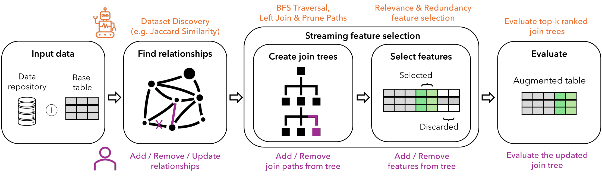

# Human-in-the-loop Feature Discovery with AutoFeat
AutoTDA is a Python-based, user-friendly library that incorporates our human-in-the-loop methodology for feature discovery, designed for seamless integration in any notebook environment. AutoTDA streamlines the process of selecting and integrating relevant tables from a dataset collection into the base table, thus creating an augmented table. Additionally, AutoTDA employs heuristic-based feature selection strategies to eliminate redundant or irrelevant features from this augmented table. By doing so, AutoTDA notably enhances the efficiency and accuracy of subsequent machine learning operations.

An overview of the AutoTDA pipeline is shown below.

## Installing
***
Install and update using [pip](https://pip.pypa.io/en/stable/getting-started/):

    $ pip install -U autotda

## Automatic Data Augmentation
***
    from autotda import TDA
    autofeat = TDA()
    autofeat.set_base_table(base_table="school/base.csv", target_column="class")
    autofeat.set_dataset_repository(dataset_repository=["school"])
    autofeat.augment_dataset()

## Human-in-the-loop Data Augmentation
***
    from autotda import TDA
    autofeat = TDA()
    autofeat.set_base_table(base_table="school/base.csv", target_column="class")
    autofeat.set_dataset_repository(dataset_repository=["school"])
    autofeat.find_relationships()
    autofeat.compute_join_trees()
    autofeat.evaluate_paths()

## Documentation
***
- Documentation: https://autofeat.readthedocs.io/ 
- Example Notebook: https://www.kaggle.com/zegermouw2/human-in-the-loop-tabular-data-augmentation  
- Demonstration Video: [https://youtu.be/z3ZmR_A0nyE](https://youtu.be/VPtKBQqVDro) 
