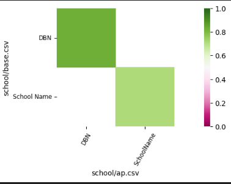

.. _use_cases:

Use Cases
=========
These use cases gives you examples to show how to use the package. Not all methods are covered. 
For that, please have a look at the :ref:`API`.

Initialize the class
--------------------
In these use cases, the class is initialized with the base table "school/base.csv" and the target column "class".
The dataset repository is set to "school". The data can be found here:

.. code-block:: python

    from autofeatinsights.autofeat_class import FeatureDiscovery
    autofeat = FeatureDiscovery()
    autofeat.set_base_table(base_table="school/base.csv", target_column="class")
    autofeat.set_dataset_repository(dataset_repository=["school"])

Run Automated Data Augmentation
-------------------------------
This code runs the entire algorithm on the repository "school" and the base table "school/base.csv" with the target column "class". 
With `Explain = True` the algorithm will show the intermediate steps and the best result.
For this result, it shows:

* The joins it made
* The selected features, with their importance, non-null ratio, relevance and redundancy
* the accuracy

The control and insights functionalties can still be used afterwards, since it will recalculate the results after calling such a function. 

.. code-block:: python

    autofeat.augment_dataset(explain=True)

Run Human-In-The-Loop Automated Data Augmentation
-------------------------------------------------

This code runs the algorithm with the intermediate steps. 
The functions: `find_relationships`, `calculate_join_trees` and `evaluate_trees` behave the same togher as `augment_dataset`.

.. code-block:: python

    autofeat.find_relationships()
    autofeat.calculate_join_trees()
    autofeat.evaluate_trees()

Add and Remove tables from the repository
-----------------------------------------
It could occur that there are tables that you know before hand, are not relevant. 
Remove them with the following function.

.. code-block:: python

    autofeat.remove_table(table="dataset/table.csv")

Or it could occur that there are some tables in another repository that are relevant. 
Add them with the following function.

.. code-block:: python

    autofeat.add_table(table="dataset/table.csv")

Calculate Relationships with Insights and Control
-------------------------------------------------

This code calculates the relationships between the columns in the base table and shows the best result of each combination of tables.

.. code-block:: python

    #Calculates the realtionships.
    autofeat.find_relationships()
    # Shows the best relationships
    autofeat.display_best_relationships()

Returns:

.. code-block:: python

    # Shows the best relationship between 2 tables.
    autofeat.display_table_relationship(table1="school/base.csv", table2="school/ap.csv")

Returns:

Remove, Update and Add Relationships

.. code-block:: python

    # Removes the relationship between 2 columns in different tables.
    autofeat.remove_relationship(table1="school/ap.csv", col1="SchoolName" table2="school/qe.csv", col2="School Name")
    # Adjust the relationship between 2 tables in different tables.
    autofeat.update_relationship(table1="school/ap.csv", col1="SchoolName" table2="school/qe.csv", col2="School Name", weight=0.2)
    # Add relationship between 2 columns in different tables.
    autofeat.add_relationship(table1="school/ap.csv", col1="SchoolName" table2="school/qe.csv", col2="School Name", weight=0.2)
 
Explains Relationships between tables.

.. code-block:: python

    # Explains the relationships betweeen 2 tables
    autofeat.explain_relationship(table1="school/base.csv", table2="school/ap.csv") 

.. list-table:: Returns
    :widths: 40 40 20
    :header-rows: 1

    * - from_table
      - to_table
      - weight
    * - school/ap.csv    
      - school/base.csv
      - 0.830286
    * - school/base.csv
      - school/ap.csv    
      - 0.830286
    * - school/ap.csv    
      - school/base.csv  
      - 0.717978
    * - school/base.csv  
      - school/ap.csv    
      - 0.717978

Calculate Join Trees with Insights and Control
----------------------------------------------

Before the join trees can be calculated, there need to be relationships between the tables.

.. code-block:: python

    autofeat.find_relationships()
    autofeat.compute_join_trees()

.. code-block:: python

    # Shows all the trees
    autofeat.display_join_trees()
    # Shows the best tree
    autofeat.display_join_trees(top_k=1)
    # Shows a single tree by id
    autofeat.display_join_tree(tree_id=2)

Example of a join tree being displayed.

.. code-block:: python

    # Shows all the details of a tree by id
    autofeat.inspect_join_tree(tree_id=3)
    # Remove a table from a tree
    autofeat.remove_join_path_from_tree(tree_id=1, table="school/ap.csv")
    # Show selected features from tree 1 and with discarded features
    autofeat.show_features(tree_id=1, show_discarded=True)
    # Explains the join tree
    autofeat.explain_tree(tree_id=1)

Evaluate Join Trees with Insights and Control
---------------------------------------------
Before you can start evaluating the trees, you need to calculate the join trees.

.. code-block:: python
    
    autofeat.find_relationships()
    autofeat.calculate_join_trees()

This evaluates the top 3 trees with the algorithm "GBM".

.. code-block:: python

    # Evaluate the top 3 trees with the algorithm "GBM"
    autofeat.evaluate_trees(algorithm='GBM', top_k_trees: int = 3, verbose=True, explain=False)

.. code-block:: python

    # Explains results of tree with id 1.
    autofeat.explain_result(tree_id=1, model="GBM")
    # Retuns the best result
    best_result = get_best_result()
    # Evaluates a single tree
    autofeat.evaluate_augmented_table(tree_id=1, algorithm='GBM', verbose=False)
    

   

