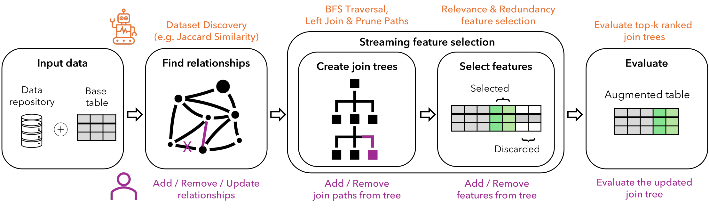

.. Autofeat documentation master file, created by
   sphinx-quickstart on Fri Feb  2 13:57:25 2024.
   You can adapt this file completely to your liking, but it should at least
   contain the root `toctree` directive.

Welcome to Autofeat's documentation!
====================================

Autofeat
================

Autofeat is a Python-based, user-friendly library that incor-
porates our human-in-the-loop methodology for feature discovery,
designed for seamless integration in any notebook environment.
The primary objective of this process is to enhance
a base table by adding new features that significantly increase the
predictive accuracy of a target ML model, specifically for classi-
fication tasks. AutoFeat streamlines the process of selecting and
integrating relevant tables from a dataset collection into the base
table, thus creating an augmented table. Additionally, AutoFeat
employs heuristic-based feature selection strategies to eliminate
redundant or irrelevant features from this augmented table. By
doing so, AutoFeat notably enhances the efficiency and accuracy
of subsequent machine learning operations.

   Workflow of AutoFeat

* To install AutoFeat, check the :ref:`installation` section.
* For the entire API documentation, check the :ref:`API` section.
* For use cases, check the :ref:`use_cases` section.

.. toctree::
   :maxdepth: 3
   :hidden:
   :caption: Contents:
      
   installation
      
   API
   Use_Cases

Indices and tables
==================

* :ref:`genindex`
* :ref:`modindex`
* :ref:`search`
